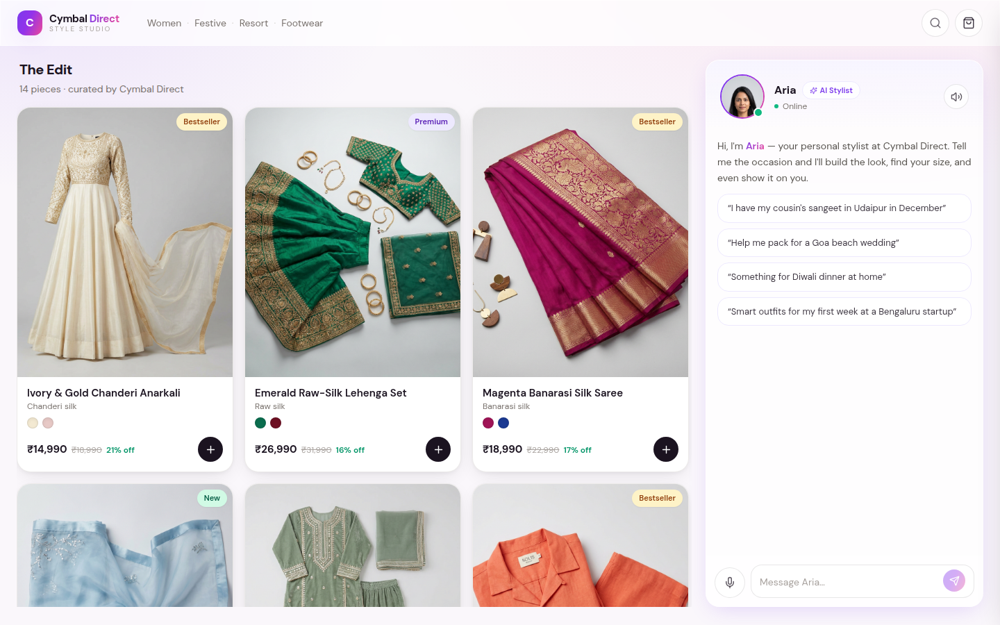

# Cymbal Direct — Style Studio

An India-first, AI-powered **conversational styling & commerce** experience for *Cymbal Direct*
(a fictional premium Indian DTC apparel & footwear brand). A photoreal AI stylist, **Aria**, converses
with the shopper, styles opinionatedly, drives the catalog/cart/checkout live, and renders **Gen-AI
Virtual Try-On** — all on Google-native AI.

Realizes `Retail_Demo_Exp_Jul26.pdf`. Built for a GCP presales demo.



## What's Google-native here
| Capability | Powered by |
|---|---|
| Conversational stylist + function-calling brain | **Gemini** (`gemini-2.5-flash`) |
| Photoreal lip-synced avatar (optional, flag-gated) | **Gemini 3.1 Live API — Live Avatar** |
| Virtual Try-On (outfit composited on the shopper, in-context) | **Gemini 3.1 Flash Image** |
| All catalog / model / backdrop imagery | **Gemini 3 Pro Image (Nano Banana Pro)** |
| Voice in / out (fallback) | Browser SpeechRecognition + SpeechSynthesis |

> **Live Avatar status:** the real video avatar is gated behind `AVATAR_TRANSPORT` and is **off by default**
> because the Live model requires an entitled project/key (see *Live Avatar* below). The demo runs fully on the
> standard Gemini brain + an animated stylist portrait, and flips to the real video avatar with one env var.

## Architecture
```
Browser (React/Vite/TS/Tailwind)  ──WebSocket──►  FastAPI backend  ──►  Gemini (Vertex, ADC)
   reactive catalog/cart/modals        ui_command       tool dispatch        + Gemini image (VTO)
```
The AI's **function-calling tools are its hands**: each call mutates demo state and streams a `ui_command`
to the browser, so the catalog filters/highlights, the cart updates, sizing/VTO/checkout modals open — live.

## Configuration (`.env`)
All settings live in a `.env` file at the repo root. **Each AI capability can target a different GCP project/region** — this matters because the Live Avatar runs in a *separate entitled project*.

```bash
cp .env.example .env      # then edit
```
Key variables (see `.env.example` for the full list + comments):

| Group | Vars | Notes |
|---|---|---|
| Default | `GCP_PROJECT`, `GCP_LOCATION` | fallback for everything below |
| Brain | `BRAIN_PROJECT`, `BRAIN_LOCATION`, `BRAIN_MODEL` | conversational Gemini (Vertex) |
| Imagery / VTO | `IMAGE_PROJECT`, `IMAGE_LOCATION`, `IMAGE_MODEL`, `VTO_MODEL` | `gemini-3-pro-image` / `gemini-3.1-flash-image` |
| **Live Avatar** | `AVATAR_TRANSPORT`, **`LIVE_PROJECT`**, `LIVE_LOCATION`, `LIVE_MODEL`, `AVATAR_NAME`, `GEMINI_API_KEY` | point `LIVE_PROJECT` at your **entitled** project |

## Authentication (ADC — no keys in code)
The app authenticates to Vertex with **Application Default Credentials**:

```bash
# local machine:
gcloud auth application-default login
gcloud config set project <your-project>

# GCP VM / Cloud Run: nothing to do — the attached service account is used automatically
#   (that SA needs the "Vertex AI User" role).
```
Verify:  `gcloud auth application-default print-access-token` should print a token.

## Run locally
Prereqs: Python 3.12+, Node 20+, and ADC set up (above).

```bash
cp .env.example .env                                            # configure projects/models

# backend
python3 -m venv .venv && ./.venv/bin/pip install -r backend/requirements.txt
./.venv/bin/python -m uvicorn backend.main:app --port 8000      # serves API + built SPA

# frontend (dev, hot reload) — in another shell
cd frontend && npm install && npm run dev                       # http://localhost:5173 (proxies to :8000)
```
Production-style (single origin): `cd frontend && npm run build`, then open `http://localhost:8000`.

### Catalog & imagery
The catalog is **100 pieces — 50 women's + 50 men's** across ~19 categories each (sherwani, bandhgala, kurta
sets, lehenga, saree, anarkali, co-ords, shirts, chinos, footwear, …).
```bash
./.venv/bin/python scripts/build_catalog.py                                  # regenerate catalog.json
./.venv/bin/python scripts/gen_assets.py --only catalog --model gemini-3.1-flash-image --workers 6
./.venv/bin/python scripts/gen_assets.py                                     # base model, backdrops, avatar
```
**Filters work like a real store** (gender tabs, category, occasion, price/newest sort, search) — and Aria's
AI styling edit overrides them (clearable). Add-to-cart / sizing / checkout are **instant** (direct, no LLM hop).

## Demo script (try by voice or text)
1. *"I have my cousin's sangeet in Udaipur in December"* → catalog restyles to festive jewel-tone silk/velvet.
2. *"I was thinking a heavy black velvet outfit"* → Aria **steers** you to a lighter festive look (opinionated).
3. *"Add the anarkali and the gold juttis"* → added with your **smart size** (M / UK5 from your profile).
4. *"Remove the juttis"* → natural-language cart editing.
5. *"Show me this look on me"* → **Virtual Try-On**: you, in the outfit, at a Udaipur palace.
6. *"Let's check out"* → review → *"apply FESTIVE10"* → confirm address → CVV → **order placed**.

## Live Avatar (real video, flip when entitled)
The real Gemini 3.1 Live Avatar is wired via a **raw Vertex `BidiGenerateContent` WebSocket proxy**
(`backend/live_proxy.py`) — the proven transport from the reference app: fragmented-MP4 video over **MSE** +
24 kHz PCM audio + live transcription, with our catalog **tools executed server-side** so the avatar drives the
same catalog/cart/checkout. Frontend client: `frontend/src/lib/liveClient.ts`; UI: the **Go Live** button in the
stylist panel streams the avatar onto a `<canvas>` with mic + end controls.

To turn it on, set in `.env`:
```
AVATAR_TRANSPORT=live
LIVE_PROJECT=<a project allowlisted for the Live Avatar Private Preview>   # NOT $PROJECT_ID
LIVE_LOCATION=us-central1
AVATAR_NAME=Kira        # or Jay, Ben, Kai, Leo, Carmen, Sam, Ingrid, Vera, Paul, Piper
AVATAR_VOICE=Aoede
```
Your **ADC identity must have access to `LIVE_PROJECT`**. `AVATAR_TRANSPORT=fallback` *(default)* uses the standard
Gemini brain + browser voice + animated portrait (no Live API).

> Verified end-to-end up to entitlement: the proxy authenticates (ADC), connects to Vertex, and sends the
> `setup` correctly — `$PROJECT_ID` returns `1008` only because it isn't allowlisted. Point `LIVE_PROJECT` at an
> entitled project to go fully live. Mic + MSE require a real browser (Chrome/Edge/Safari), not headless.

## Deploy to Cloud Run
```bash
./deploy.sh $PROJECT_ID us-central1
```
Runs as the Cloud Run runtime service account (no keys in the image); that SA needs **Vertex AI User**.
The Gemini calls target Vertex `us-central1` (text/VTO) and `global` (Gemini 3 Pro Image), independent of the
Cloud Run region.

## Troubleshooting
- **`MutualTLSChannelError: No module named 'OpenSSL'`** — your machine has context-aware access / mTLS enabled
  (`GOOGLE_API_USE_CLIENT_CERTIFICATE=true`). Install the cert library:  `./.venv/bin/pip install pyopenssl`
  (already in `requirements.txt`). Alternatively, if you don't need mTLS: `export GOOGLE_API_USE_CLIENT_CERTIFICATE=false`.
- **`PermissionDenied` / `403`** — the ADC identity lacks **Vertex AI User** on the project, or you didn't run
  `gcloud auth application-default login`.

## Notes
- Catalog, sizing engine, payment/CVV, and addresses are realistic **in-memory mocks**. CVV is never logged or stored.
- Generated images carry a SynthID watermark.
